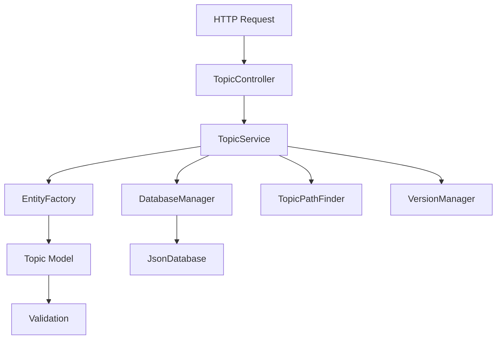
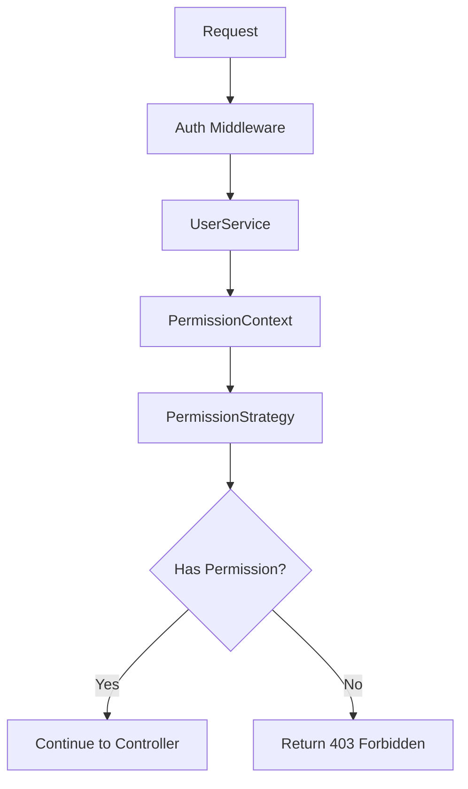

# Architecture Documentation

## Overview

The Dynamic Knowledge Base System is built using a layered architecture with clear separation of concerns, implementing enterprise-grade design patterns and following SOLID principles.

## Architecture Layers

```
┌─────────────────────────────────────────┐
│             HTTP Layer                  │
│         (Express Routes)                │
├─────────────────────────────────────────┤
│           Controller Layer              │
│        (Request/Response)               │
├─────────────────────────────────────────┤
│            Service Layer                │
│         (Business Logic)                │
├─────────────────────────────────────────┤
│            Pattern Layer                │
│    (Factory, Strategy, Composite)       │
├─────────────────────────────────────────┤
│             Model Layer                 │
│         (Entity Models)                 │
├─────────────────────────────────────────┤
│           Database Layer                │
│        (Data Persistence)               │
└─────────────────────────────────────────┘
```

## Design Patterns Implementation

### 1. Factory Pattern

#### Entity Factory
Creates different types of entities with proper initialization and validation.

```typescript
// Abstract Factory
export abstract class EntityFactory {
  public static createTopic(data: CreateTopicData): Topic
  public static createResource(data: CreateResourceData): Resource
  public static createUser(data: CreateUserData): User
}

// Specialized Factories
export class TopicVersionFactory extends EntityFactory {
  public static createNewVersion(originalTopic: Topic): Topic
  public static createInitialVersion(data: TopicData): Topic
}
```

**Benefits:**
- Centralized object creation logic
- Type-specific validation and initialization
- Consistent object creation across the application
- Easy to extend with new entity types

#### Usage Example:
```typescript
// Creating a topic with factory
const topic = EntityFactory.createTopic({
  name: 'JavaScript Basics',
  content: 'Introduction to JavaScript'
});

// Creating a new version
const newVersion = TopicVersionFactory.createNewVersion(topic);
```

### 2. Strategy Pattern

#### Permission Strategy
Implements different permission strategies for user roles.

```typescript
// Strategy Interface
export interface IPermissionStrategy {
  hasPermission(permission: Permission): boolean;
  getPermissions(): Permission[];
  canPerformAction(action: string, resourceType: string): boolean;
}

// Concrete Strategies
export class AdminPermissionStrategy implements IPermissionStrategy {
  public hasPermission(): boolean { return true; }
}

export class EditorPermissionStrategy implements IPermissionStrategy {
  public hasPermission(permission: Permission): boolean {
    return [Permission.CREATE, Permission.READ, Permission.UPDATE]
      .includes(permission);
  }
}

// Context
export class PermissionContext {
  private strategy: IPermissionStrategy;
  
  constructor(role: UserRole) {
    this.setStrategy(role);
  }
  
  public hasPermission(permission: Permission): boolean {
    return this.strategy.hasPermission(permission);
  }
}
```

**Benefits:**
- Flexible permission system
- Easy to add new roles
- Runtime strategy switching
- Clean separation of role-specific logic

### 3. Composite Pattern

#### Topic Hierarchy
Implements hierarchical topic structure with uniform interface.

```typescript
// Component
export abstract class TopicComponent {
  public abstract operation(): void;
  public abstract getSize(): number;
  public abstract toHierarchy(): ITopicHierarchy;
}

// Leaf
export class TopicLeaf extends TopicComponent {
  private topic: Topic;
  
  public operation(): void {
    console.log(`Processing topic: ${this.topic.name}`);
  }
}

// Composite
export class TopicComposite extends TopicComponent {
  private children: Map<string, TopicComponent> = new Map();
  
  public add(component: TopicComponent): void {
    this.children.set(component.getId(), component);
  }
  
  public operation(): void {
    console.log(`Processing composite: ${this.name}`);
    for (const child of this.children.values()) {
      child.operation();
    }
  }
}
```

**Benefits:**
- Uniform interface for individual topics and hierarchies
- Recursive operations on topic trees
- Easy to add new composite behaviors
- Client code doesn't need to distinguish between leaf and composite

## SOLID Principles Implementation

### 1. Single Responsibility Principle (SRP)

Each class has a single, well-defined responsibility:

- **Models**: Entity data and validation
- **Services**: Business logic and orchestration
- **Controllers**: HTTP request/response handling
- **Repositories**: Data persistence operations
- **Middleware**: Cross-cutting concerns (auth, validation, errors)

### 2. Open/Closed Principle (OCP)

The system is open for extension but closed for modification:

- **Permission Strategies**: New roles can be added without modifying existing strategies
- **Entity Factories**: New entity types can be added without changing core factory logic
- **Validation**: New validation rules can be added through configuration

### 3. Liskov Substitution Principle (LSP)

Derived classes can be substituted for their base classes:

- **Topic Components**: Leaf and Composite topics are interchangeable
- **Permission Strategies**: All strategies implement the same interface
- **Database Implementations**: Different storage backends can be swapped

### 4. Interface Segregation Principle (ISP)

Interfaces are focused and client-specific:

- **IVersionable**: Only versioning-related methods
- **IComposite**: Only hierarchy-related methods
- **IPermissionStrategy**: Only permission-related methods

### 5. Dependency Inversion Principle (DIP)

High-level modules depend on abstractions:

- **Services depend on interfaces**, not concrete database implementations
- **Controllers depend on service interfaces**, not concrete services
- **Database abstraction layer** allows for different storage backends

## Data Flow Architecture

### Request Flow
```
HTTP Request → Middleware → Controller → Service → Model → Database
                ↓             ↓          ↓        ↓       ↓
           Validation    Business    Entity   Data
           Auth          Logic       Logic    Persistence
           Error         
           Handling      
```

### Response Flow
```
Database → Model → Service → Controller → Middleware → HTTP Response
    ↓        ↓       ↓         ↓           ↓           ↓
  Raw      Entity   Business  Response    Error       JSON
  Data     Objects  Logic     Formatting  Handling    Response
```

## Component Interactions

### Topic Management Flow


### Permission Checking Flow


## Database Architecture

### File-Based Database Layer
```
JsonDatabase<T>
├── In-memory caching (Map<string, T>)
├── Auto-save functionality
├── Backup and restore
├── Atomic operations
└── Index management
```

### Database Manager
```
DatabaseManager (Singleton)
├── Topics Database
├── Topic Versions Database
├── Resources Database
├── Users Database
├── Health monitoring
└── Backup coordination
```

## Algorithm Implementation

### Shortest Path Algorithm
Custom implementation of Dijkstra's algorithm for topic hierarchy navigation:

```typescript
export class TopicPathFinder {
  private topics: Map<string, ITopicData>;
  private adjacencyList: Map<string, Set<string>>;
  
  public findShortestPath(startId: string, endId: string): ShortestPath | null {
    // Custom Dijkstra implementation
    // Considers content similarity in edge weights
    // Returns complete path with topics and distance
  }
}
```

**Features:**
- **Content Similarity**: Edge weights consider topic content similarity
- **Bidirectional Graph**: Parent-child relationships work both ways
- **Multiple Paths**: Find all paths within distance limits
- **Common Ancestors**: Identify shared parent topics

## Error Handling Architecture

### Error Hierarchy
```
BaseError (Abstract)
├── ValidationError (400)
├── UnauthorizedError (401)
├── ForbiddenError (403)
├── NotFoundError (404)
├── ConflictError (409)
├── BusinessLogicError (422)
├── RateLimitError (429)
├── InternalServerError (500)
├── DatabaseError (500)
└── ServiceUnavailableError (503)
```

### Error Flow
```
Error Occurs → Custom Error → Error Middleware → Formatted Response
     ↓             ↓              ↓                    ↓
  Business      Type-specific   Logging &           Client-safe
  Logic         Error Class     Monitoring          Error Message
```

## Middleware Stack

### Request Processing Pipeline
```
1. CORS Handling
2. Security Headers (Helmet)
3. Rate Limiting
4. Body Parsing
5. Request Logging
6. Authentication
7. Authorization
8. Route Handler
9. Error Handling
10. Response Formatting
```

## Testing Architecture

### Test Structure
```
tests/
├── unit/
│   ├── models/         # Entity model tests
│   ├── services/       # Business logic tests
│   ├── algorithms/     # Algorithm tests
│   └── utils/          # Utility function tests
├── integration/
│   ├── api.test.ts     # Full API workflow tests
│   └── database.test.ts # Database integration tests
└── setup.ts            # Test configuration
```

### Testing Strategy
- **Unit Tests**: Test individual components in isolation
- **Integration Tests**: Test complete workflows and API endpoints
- **Mocking**: Mock external dependencies and database operations
- **Custom Matchers**: Extended Jest matchers for domain-specific assertions

## Performance Considerations

### Caching Strategy
- **In-memory caching** for frequently accessed data
- **Lazy loading** of topic hierarchies
- **Efficient indexing** for search operations
- **Connection pooling** simulation for database operations

### Optimization Techniques
- **Pagination** for large result sets
- **Batch operations** for bulk updates
- **Efficient algorithms** for path finding and tree traversal
- **Response compression** for large payloads

## Security Architecture

### Authentication & Authorization
- **Header-based authentication** (demo implementation)
- **Role-based access control** with strategy pattern
- **Permission validation** at multiple layers
- **Resource ownership** checks

### Input Validation
- **Schema validation** with Joi
- **XSS prevention** through input sanitization
- **Content validation** for safe data storage
- **URL validation** for resource links

## Scalability Considerations

### Horizontal Scaling
- **Stateless design** allows for multiple instances
- **Database abstraction** supports distributed databases
- **Microservice ready** architecture with clear boundaries

### Vertical Scaling
- **Efficient algorithms** for large datasets
- **Memory management** with proper cleanup
- **Connection optimization** for database operations

## Extension Points

### Adding New Features
1. **New Entity Types**: Extend factory patterns and add new models
2. **New User Roles**: Create new permission strategies
3. **New Algorithms**: Add to algorithms directory with service integration
4. **New Database Backends**: Implement database interfaces
5. **New Authentication Methods**: Extend middleware stack

### Configuration Management
- **Environment-based configuration**
- **Runtime configuration updates**
- **Feature flags** for gradual rollouts
- **Database migration** support

This architecture provides a solid foundation for a scalable, maintainable, and extensible knowledge base system while demonstrating advanced software engineering principles and patterns.
